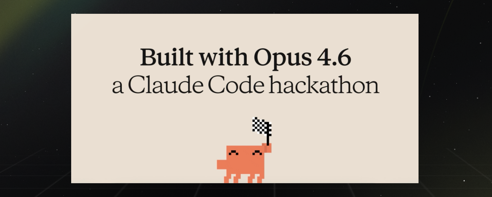

# ScuttlePay

A Claude Code plugin that lets your agent spend USDC. Search products, check balances, and make purchases on Shopify storefronts — settled on-chain via Base.

---

## What is ScuttlePay?

Wallet-as-a-service for AI agents. Your agent gets a USDC wallet, browses real Shopify stores, and buys products — all settled on-chain on Base.

| What Your Agent Can Do | How |
|------------------------|-----|
| **Check balance** | "What's my ScuttlePay balance?" |
| **Browse stores** | "List available merchants on ScuttlePay" |
| **Search products** | "Search for headphones under $50" |
| **Buy products** | "Buy the Sony WH-1000XM5" |
| **View history** | "Show my recent transactions" |

## How It Works

The plugin provides a skill that teaches Claude how to call the ScuttlePay REST API. No MCP server or separate process needed — Claude calls the endpoints directly.

```
User → Claude Code → ScuttlePay API → Shopify Storefront
                                     → USDC transfer on Base
```

**Endpoints your agent uses:**

| Method | Endpoint | Purpose |
|--------|----------|---------|
| `GET` | `/api/mcp/wallet` | Balance and wallet info |
| `GET` | `/api/mcp/merchants` | List available stores |
| `GET` | `/api/mcp/products` | Search or get product details |
| `POST` | `/api/mcp/purchase` | Execute a purchase |
| `GET` | `/api/mcp/transactions` | Transaction history |

---

## Configuration

Two environment variables are required:

| Variable | Description |
|----------|-------------|
| `SCUTTLEPAY_API_KEY` | Your API key (starts with `sk_`) — get it from the [dashboard](https://scuttlepay.com/dashboard/setup) |
| `SCUTTLEPAY_API_URL` | ScuttlePay instance URL (e.g. `https://scuttlepay.com`) |

---

## Safety

The plugin instructs Claude to **always confirm purchases with you before executing**. Your agent will show the product, price, and merchant before spending any USDC.

Spending limits (per-transaction and daily) are configured when you create your API key in the dashboard.

---

## License

MIT — see [LICENSE](LICENSE)
