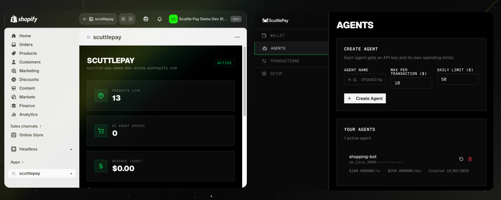

# ScuttlePay

[ScuttlePay](https://www.scuttlepay.com) lets AI agents buy things online - no humans (or credit cards) required.

- **For merchants**: Allow AI agents to discover and purchase products from your store.
  1. A **Shopify plugin** that exposes your store's products to AI agents via an API.
  2. An **admin dashboard** for merchants to see purchases made by AI agents on their store.

- **For agents**: Browse items and buy products - without a human in the loop!
  1. A **User dashboard** where you can add funds and set spending limits for your AI agents.
  2. An **agent skill** to teach agents how to autonomously purchase products.



## How It Works

### Architecture

```
┌─────────────┐     REST API      ┌──────────────────────────────────────────────┐
│  AI Agent   │◄────(sk_* key)───►│              ScuttlePay                      │
│  (Claude)   │                   │                                              │
└─────────────┘                   │  ┌──────────┐  ┌──────────┐  ┌───────────┐  │
                                  │  │  Spending │  │  Wallet   │  │  Payment  │  │
                                  │  │  Policies │  │  Service  │  │  Service  │  │
                                  │  └────┬─────┘  └────┬──────┘  └─────┬─────┘  │
                                  │       │             │               │         │
                                  │       ▼             ▼               ▼         │
                                  │  ┌─────────┐  ┌──────────┐  ┌───────────┐   │
                                  │  │ Postgres │  │ thirdweb │  │  Stripe   │   │
                                  │  │          │  │ Engine   │  │  x402     │   │
                                  │  └──────────┘  └────┬─────┘  └─────┬─────┘  │
                                  └─────────────────────┼──────────────┼────────┘
                                                        │              │
                                                        ▼              ▼
                                                   ┌─────────┐  ┌───────────┐
                                                   │  Base    │  │  Shopify  │
                                                   │  (USDC)  │  │  Admin    │
                                                   └─────────┘  └───────────┘
```

ScuttlePay is a Next.js 15 app backed by PostgreSQL, [thirdweb Engine](https://thirdweb.com/engine) for wallet management, and [Stripe x402](https://docs.stripe.com/crypto/pay-with-crypto) for settlement. Agents authenticate with API keys (`sk_*`) and interact through a REST API — no MCP server or separate process needed.

### Agent wallets and API keys

When a user signs up, ScuttlePay creates a **server-side wallet** on Base via thirdweb Engine. The user funds it with USDC, then creates API keys from the dashboard — each key is bound to a **spending policy** with per-transaction and daily limits (in USDC). The raw key is shown once; only a SHA-256 hash is stored.

### Purchase flow

When an agent calls `POST /api/mcp/purchase`:

1. **Product lookup** — Fetch the product (and optional variant) from the merchant's Shopify Storefront API. Resolve the USDC price.
2. **Serializable transaction** — Inside a single Postgres `SERIALIZABLE` transaction:
   - Read the wallet's on-chain USDC balance
   - Evaluate spending limits (per-tx max, daily cap with UTC window)
   - Insert a `PENDING` transaction row
3. **Settlement** — Transfer USDC on Base to Stripe's x402 crypto deposit address (or directly to a settlement address in testnet mode). thirdweb Engine signs and submits the transaction.
4. **Order creation** — Create an order in Shopify Admin marked as `PAID` with the blockchain tx hash as payment proof. This step is non-fatal — if Shopify is down, the agent's payment still settles.

All USDC math uses `bigint` arithmetic (never floating point) to preserve 6-decimal precision.

### Merchant onboarding

Merchants install the Shopify app, which stores their Storefront API token (for product browsing) and Admin API token (for order creation). They connect a Stripe account to receive settlement payouts. The merchant dashboard shows orders placed by agents and sales stats.

### Agent-facing API

| Method | Endpoint | Purpose |
|--------|----------|---------|
| `GET` | `/api/mcp/wallet` | Balance and wallet info |
| `GET` | `/api/mcp/merchants` | List available stores |
| `GET` | `/api/mcp/products` | Search or get product details |
| `POST` | `/api/mcp/purchase` | Execute a purchase |
| `GET` | `/api/mcp/transactions` | Transaction history |

### Stack

| Layer | Tech |
|-------|------|
| Frontend | Next.js 15 (App Router), React 19, Tailwind 4, shadcn/ui |
| API | tRPC 11 + TanStack Query 5, Next.js route handlers |
| Database | PostgreSQL (Drizzle ORM) |
| Wallets | thirdweb Engine (server-side wallets on Base) |
| Payments | Stripe x402 crypto mode (USDC on Base) |
| Validation | Zod (shared schemas in `packages/shared`) |
| Auth | thirdweb wallet signatures (JWT) + API keys |

---

## Configuration

Two environment variables are required:

| Variable | Description |
|----------|-------------|
| `SCUTTLEPAY_API_KEY` | Your API key (starts with `sk_`) — get it from the [dashboard](https://scuttlepay.com/dashboard/setup) |
| `SCUTTLEPAY_API_URL` | ScuttlePay instance URL (e.g. `https://scuttlepay.com`) |

---

## Safety

The plugin instructs Claude to **always confirm purchases with you before executing**. Your agent will show the product, price, and merchant before spending any USDC.

Spending limits (per-transaction and daily) are configured when you create your API key in the dashboard. Limits are enforced server-side inside a serializable database transaction — agents cannot circumvent them.

---

## License

MIT — see [LICENSE](LICENSE)
